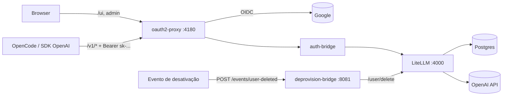
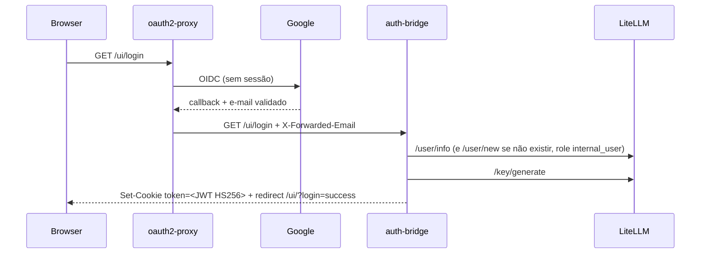

# ai-gateway-with-auth-proxy

Experimento (PoC) de **AI Gateway com SSO** usando apenas componentes open source: **LiteLLM community** atrás de **oauth2-proxy** + um pequeno **auth-bridge** em FastAPI, com **Google** como IdP, rodando localmente via `docker compose`.

Objetivo: provar que é possível logar na Admin UI do LiteLLM via SSO — sem o form nativo de usuário/senha e **sem licença Enterprise** — e, pelo mesmo ponto de entrada, expor a API OpenAI-compatible (`/v1/*`) autenticada por virtual key para clientes como **OpenCode** e SDKs OpenAI.

> Status: PoC validado localmente. **Não é production-ready** — ver [Simplificações deliberadas](#simplificações-deliberadas).

## Sumário

- [Arquitetura](#arquitetura)
- [Componentes](#componentes)
- [Estrutura do repositório](#estrutura-do-repositório)
- [Pré-requisitos](#pré-requisitos)
- [Setup](#setup)
- [Testar o fluxo de login](#testar-o-fluxo-de-login)
- [Configurar no OpenCode](#configurar-no-opencode)
- [Desprovisionamento de usuário](#desprovisionamento-de-usuário)
- [Troubleshooting](#troubleshooting)
- [Achados que corrigiram a hipótese inicial](#achados-que-corrigiram-a-hipótese-inicial)
- [Simplificações deliberadas](#simplificações-deliberadas)
- [Fora de escopo](#fora-de-escopo)

## Arquitetura



| Rota | Quem autentica |
|---|---|
| `/ui`, `/key/*`, `/user/*` etc. | oauth2-proxy (sessão Google) |
| `/v1/*` (OpenCode, SDKs OpenAI) | auth-bridge (exige `Bearer sk-...`) + LiteLLM (valida a virtual key) |

Tudo entra pelo `:4180`. LiteLLM, auth-bridge e Postgres ficam só na rede docker interna — o LiteLLM nunca é exposto direto.

### Sequência de login SSO



## Componentes

| Serviço | Exposto ao host | Papel |
|---|---|---|
| **oauth2-proxy** | `:4180` | Único ponto de entrada. Faz OIDC com Google para UI/admin. `/v1/*` liberado de sessão (`OAUTH2_PROXY_SKIP_AUTH_ROUTES`) e autenticado pela virtual key. |
| **auth-bridge** (`./auth-bridge`) | não | Intercepta `/ui/login`: lê `X-Forwarded-Email` (já validado pelo oauth2-proxy), garante o usuário no LiteLLM como `internal_user`, gera virtual key e assina o mesmo JWT que o LiteLLM usaria nativamente (`ReturnedUITokenObject`, HS256 com o master key), setando o cookie `token`. Em `/v1/*` exige `Authorization: Bearer sk-...` e descarta `X-Forwarded-*` vindos do cliente. Demais paths: proxy em streaming (SSE), sem timeout de leitura. |
| **litellm** | não | Gateway OpenAI-compatible. Config em `litellm/config.yaml`. |
| **postgres** | não | Obrigatório: LiteLLM (Prisma) precisa de banco para sessão de UI/virtual keys. Migração roda sozinha no start. |
| **deprovision-bridge** (`./deprovision-bridge`) | `:8081` (só PoC) | Recebe evento de usuário desativado/excluído e chama `/user/delete` no LiteLLM. Simula o worker que, em produção, reagiria a change notifications do IdP. |

### Modelos

`litellm/config.yaml` usa wildcard para OpenAI (exige `OPENAI_API_KEY` no `.env`):

- `openai/*` — ex.: `openai/gpt-5.4`
- `*` — nome sem prefixo, ex.: `gpt-5.4`
- `check_provider_endpoint: true` — `/v1/models` lista os modelos reais da conta OpenAI

## Estrutura do repositório

```
.
├── docker-compose.yml          # stack completa (postgres, litellm, auth-bridge, deprovision-bridge, oauth2-proxy)
├── .env.example                # modelo de variáveis — copiar para .env (não versionado)
├── litellm/
│   └── config.yaml             # model_list + master key via env
├── auth-bridge/                # FastAPI: SSO -> sessão LiteLLM + guarda de /v1/*
│   ├── Dockerfile
│   ├── requirements.txt
│   └── app.py
├── deprovision-bridge/         # FastAPI: evento de desativação -> /user/delete
│   ├── Dockerfile
│   ├── requirements.txt
│   └── app.py
└── litellm-sso-opencode.md     # write-up completo do experimento (passo a passo com código)
```

## Pré-requisitos

- Docker + Docker Compose v2
- Projeto no Google Cloud com OAuth client (Web application)
- `openssl` (para gerar o cookie secret)
- Opcional: `OPENAI_API_KEY` para testar completions reais (não é necessário para o fluxo de login)

## Setup

1. **OAuth client no Google:** Google Cloud Console > APIs & Services > Credentials > OAuth client ID (Web application). Redirect URI autorizada: `http://localhost:4180/oauth2/callback`.
2. **Variáveis de ambiente:**
   ```bash
   cp .env.example .env
   ```
   Preencher no `.env`:

   | Variável | Obrigatória | Descrição |
   |---|---|---|
   | `GOOGLE_CLIENT_ID` / `GOOGLE_CLIENT_SECRET` | sim | Credenciais do OAuth client |
   | `OAUTH2_PROXY_COOKIE_SECRET` | sim | `openssl rand -base64 32 \| tr -- '+/' '-_'` |
   | `OAUTH2_PROXY_EMAIL_DOMAINS` | não | `*` (default, qualquer conta) ou `seu-dominio.com.br` |
   | `LITELLM_MASTER_KEY` | sim | Trocar o placeholder por um valor aleatório (`sk-...`) |
   | `OPENAI_API_KEY` | não | Só para chamadas reais de completion |

3. **Subir:**
   ```bash
   docker compose up -d --build
   docker compose ps
   ```

> O `.env` está no `.gitignore` — nunca versionar credenciais reais.

## Testar o fluxo de login

- Acessar `http://localhost:4180/ui/login` — sem sessão, redireciona para o Google.
- Logar com uma conta Google — volta autenticado direto no dashboard (`/ui/?login=success`), sem ver o form nativo.
- Logout sai de verdade: limpa também a sessão do oauth2-proxy via `PROXY_LOGOUT_URL`, não só o cookie do LiteLLM.

## Configurar no OpenCode

1. **Criar a virtual key:** `http://localhost:4180/ui` > login Google > **Virtual Keys** > **+ Create New Key**. Copiar o `sk-...` (só aparece uma vez). Não usar a key gerada automaticamente no login (expira em 24h).
2. **Guardar a key em variável de ambiente** (PowerShell, abrir terminal novo depois):
   ```powershell
   setx LITELLM_API_KEY "sk-xxxx"
   ```
3. **Configurar o provider** em `%USERPROFILE%\.config\opencode\opencode.json` (global) ou `opencode.json` na raiz do projeto:
   ```json
   {
     "$schema": "https://opencode.ai/config.json",
     "provider": {
       "litellm": {
         "npm": "@ai-sdk/openai-compatible",
         "name": "LiteLLM (PoC)",
         "options": {
           "baseURL": "http://localhost:4180/v1",
           "apiKey": "{env:LITELLM_API_KEY}"
         },
         "models": {
           "gpt-5.5":      { "name": "GPT-5.5" },
           "gpt-5.4":      { "name": "GPT-5.4" },
           "gpt-5.4-mini": { "name": "GPT-5.4 mini" },
           "gpt-4.1":      { "name": "GPT-4.1" },
           "o4-mini":      { "name": "o4-mini" }
         }
       }
     },
     "model": "litellm/gpt-5.4"
   }
   ```
   Provider custom não descobre modelos sozinho — listar em `models` os IDs desejados (ver `/v1/models`). Alternativa ao env var: `opencode auth login` > **Other** > provider id `litellm`, e remover `apiKey` do JSON.
4. **Testar:**
   ```powershell
   curl.exe http://localhost:4180/v1/models -H "Authorization: Bearer $env:LITELLM_API_KEY"
   ```
   No `opencode`: `/models` > **LiteLLM (PoC)** > modelo > prompt. Uso aparece em **Usage/Logs** na UI do LiteLLM.

## Desprovisionamento de usuário

O `deprovision-bridge` simula o worker que, em produção, reagiria a um evento do IdP (ex.: change notification do Microsoft Graph). No PoC o evento é disparado manualmente. Como `user_id` no LiteLLM = e-mail (mesma convenção do auth-bridge), basta o e-mail:

```bash
curl -X POST http://localhost:8081/events/user-deleted \
  -H "Content-Type: application/json" \
  -d '{"email": "fulano@exemplo.com"}'
```

Health check: `GET http://localhost:8081/health`.

> A porta `8081` fica exposta sem autenticação só para facilitar o teste. Em produção esse endpoint deve exigir segredo compartilhado/assinatura do emissor e não ficar publicado.

## Troubleshooting

| Sintoma | Causa |
|---|---|
| `401 Missing virtual key` | Header `Authorization` ausente / env var não carregada |
| `401` do LiteLLM | Key inválida ou expirada |
| `302` pro Google em `/v1` | oauth2-proxy sem `OAUTH2_PROXY_SKIP_AUTH_ROUTES` (recriar o container) |
| Modelo não aparece no OpenCode | Não listado em `models` do `opencode.json` |
| `400 ... not supported in v1/chat/completions` | Modelo só Responses API (ex.: `*-codex`, `*-pro`) |
| `Only proxy admin can be used to generate ... Your role=unknown` | Usuário não existe em `LiteLLM_UserTable` (auth-bridge desatualizado) |

Logs: `docker compose logs -f auth-bridge oauth2-proxy litellm`.

## Achados que corrigiram a hipótese inicial

- O header que o oauth2-proxy realmente manda no modo reverse-proxy nativo é **`X-Forwarded-Email`**, não `X-Auth-Request-Email` (esse é só do modo nginx `auth_request`).
- LiteLLM **exige `DATABASE_URL`** para qualquer login de UI (SSO nativo ou senha) — sem banco, `/key/generate` interno falha.
- Logout do LiteLLM só limpa o cookie `token` dele; a sessão do oauth2-proxy (`_oauth2_proxy`) sobrevive e reloga na hora se o logout não for redirecionado também para `/oauth2/sign_out` (via `PROXY_LOGOUT_URL`).
- A Admin UI do LiteLLM não tem campo de foto/avatar (nem no SSO nativo) — só iniciais do e-mail. Não é bug do PoC.
- `/key/generate` com `user_id` **não cria o usuário** em `LiteLLM_UserTable`. Sem o registro, o LiteLLM trata o dono como `role=unknown` e bloqueia criação de key pela UI. O auth-bridge faz `/user/new` com `user_role: internal_user` antes.
- oauth2-proxy não valida virtual key do LiteLLM: sem sessão, qualquer request (inclusive com `Bearer sk-...`) leva `302` para o Google. `skip_jwt_bearer_tokens` só aceita JWT do IdP, e clientes de API (OpenCode) não fazem OIDC no browser. Solução: `OAUTH2_PROXY_SKIP_AUTH_ROUTES=^/v1/` + validação da key no auth-bridge/LiteLLM.
- O repasse original do auth-bridge bufferizava a resposta inteira com timeout de 30s — quebrava streaming (SSE) do OpenCode. Trocado por `client.send(stream=True)` + `StreamingResponse`, sem timeout de leitura.
- Em rotas liberadas pelo `SKIP_AUTH_ROUTES`, o oauth2-proxy não sobrescreve `X-Forwarded-Email` — o cliente poderia forjar identidade. O auth-bridge descarta `X-Forwarded-*` em `/v1/*`.

## Simplificações deliberadas

Não usar em produção sem ajustar:

- `auth-bridge` gera uma virtual key de UI **nova a cada login** (usuário é idempotente via `/user/info`, a key não). Produção precisa reaproveitar/revogar a key anterior.
- Wildcard `*` no `config.yaml` manda qualquer nome de modelo para a OpenAI. Produção: lista explícita de modelos ou `models` restrito por key/team.
- `OAUTH2_PROXY_EMAIL_DOMAINS=*` libera qualquer conta Google. Restringir por domínio em qualquer ambiente real.
- Credenciais do Postgres fixas no `docker-compose.yml` (`litellm/litellm`) — aceitável só porque o banco não tem porta publicada.
- `deprovision-bridge` exposto em `:8081` sem autenticação.
- Imagens com tag móvel (`main-stable`, `latest`) — fixar versão/digest.
- Sem TLS (tudo `http://localhost`), sem WAF/rate limit.

## Fora de escopo

- Microsoft Entra ID — Google usado só por ser mais rápido de configurar localmente. Trocar é mudar `OAUTH2_PROXY_PROVIDER` e as envs correspondentes.
- Integração real do desprovisionamento com o IdP (Graph change notification / subscription) — aqui o evento é manual.
